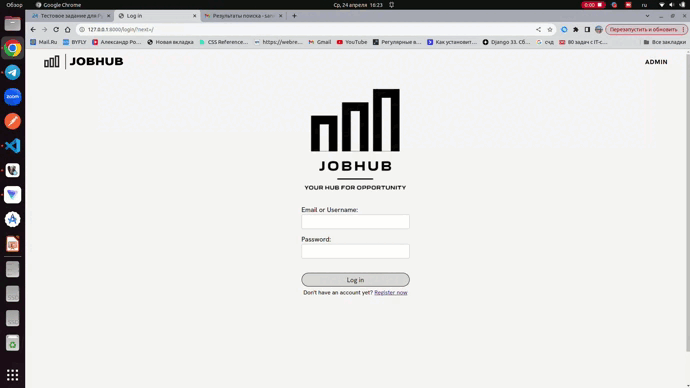

# JobHub

Привет. Это тестовый проект JobHub. Необходимо было написать приложение на Django, где будут реализованы два кабинета пользователя и админ-панель. В качестве БД использовать PostgreSQL.

В конце файла прикреплена GIF-ка с демонстрацией работы приложения.

Я использовал Django и его встроенную админку. Для приложения выбрана архитектура N-Layer. Создал один docker-compose для удобного развёртывания базы данных.

## Инструкции по запуску

1. В корне проекта создайте папку "db".
2. В корне проекта создайте файл ".env". Рядом с ним лежит шаблон ".env.template". Я там оставил все данные для быстрого запуска, в том числе мой бесплатный аккаунт на ElasticEmail для отправки email сообщений.
3. Создайте и активируйте окружение Poetry (если хотите, можете и обычным способом, достав зависимости из служебных файлов Poetry).
4. Запустите контейнер с БД командой `sudo docker compose -f docker-compose-dev.yaml --env-file .env up -d`.
5. Создайте миграции и выполните их: `python3 manage.py makemigrations`, `python3 manage.py migrate`.
6. Запустите сервер: `python3 manage.py runserver`.

## Демонстрация работы

